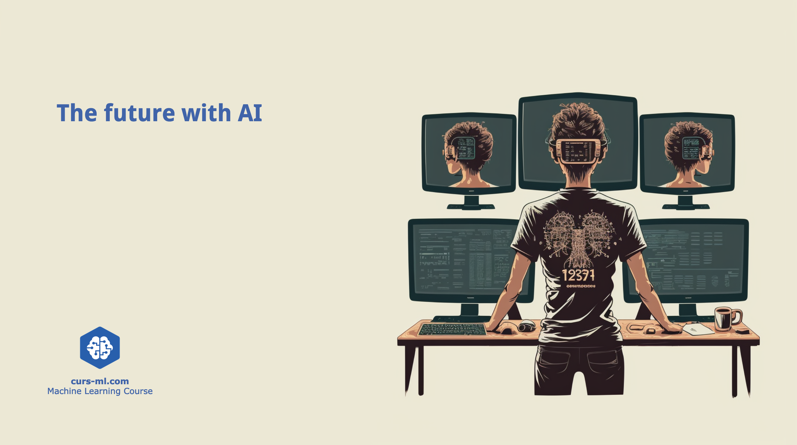

# The Future with AI

"The Future with AI" is a recurring 2-hour workshop designed to delve into the evolving frontier of ML/AI technologies. This dynamic series welcomes attendees from all walks—whether you're a student taking your first step into the AI realm or a seasoned practitioner.

The workshop is organized by [Curs ML](https://www.curs-ml.com) and [Xetten AI](https://www.xetten.ai).

[Meetup page](https://www.meetup.com/meetup-group-twymnrcp/)

