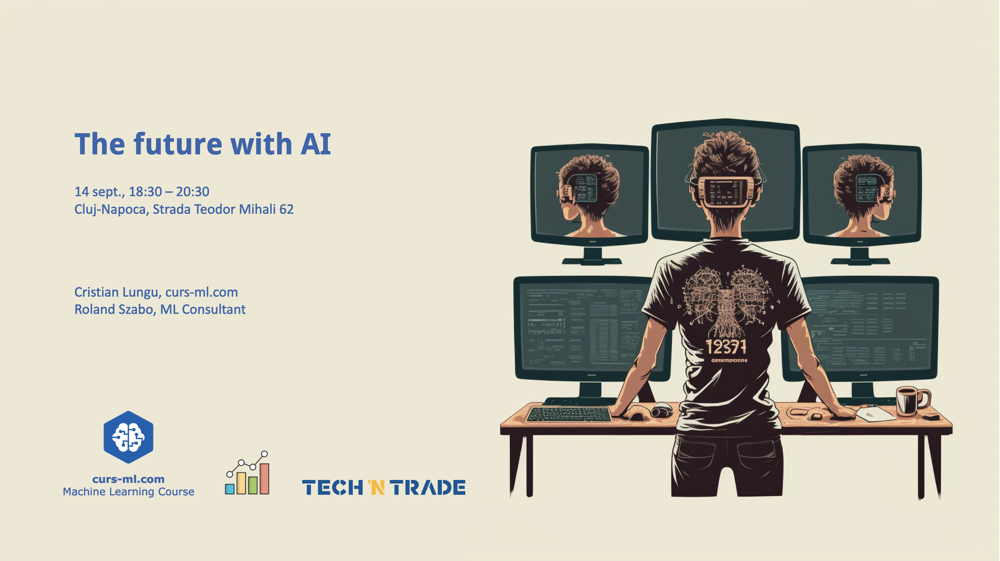

# [Agenda](Agenda.pdf)

* Introductions
* AI news
* Announcements

# [Hello (machine learning) world!](hello_%28machine%20learning%29_world.pdf)
by Cristian Lungu

Speaker Info: Cristian Lungu, PhDc, is a prominent leader in the ML field,  trainer at curs-ml.com and senior ML  consultant at Xetten AI. His main focus is enabling grow by helping companies optimise their costs and boost their revenues through customised ML solutions applied on proprietary data.

# [RAG and Roll: Revolutionizing Knowledge-Based Chatbots with LLMs](...)
by Roland Szabo

Speaker Info: Roland Szabo is a machine learning consultant helping companies get started with artificial intelligence. He's been doing ML for more than 10 years, at companies such as Google, but also at small startups. He is focused on making text data more valuable to companies, helping them understand unstructured data, extract information from it and even talk to the data.