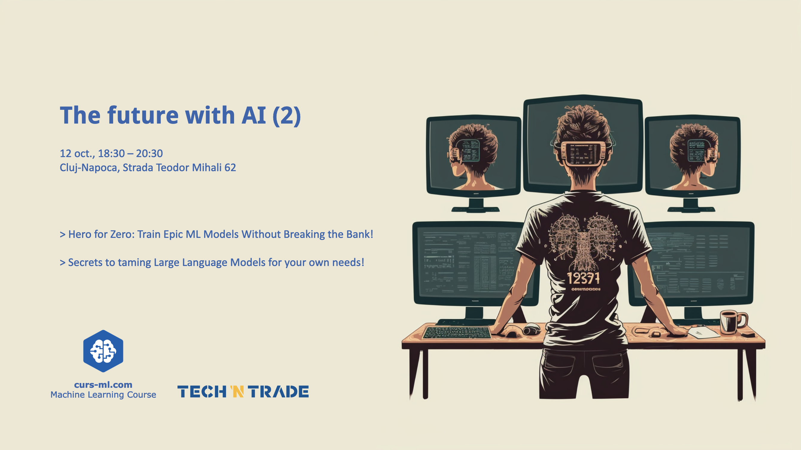

# [Agenda](agenda.pdf)

* Introductions
* AI news
* Announcements

# [Hero for Zero: Train Epic ML Models Without Breaking the Bank!](hero_for_zero.pdf)

Delves into the world of budget-friendly machine learning. With the rise of ML and AI, there's a misconception that building powerful models demands hefty resources. This talk shatters that myth, showcasing how enthusiasts can harness free platforms or open-source projects to train models without incurring expenses. It underscores the capabilities of these platforms, from GPU access to seamless notebook integrations. Moreover, it provides guidance on maximizing local deployments, ensuring that you don't compromise on quality while being cost-conscious. Whether you're a budding data scientist or an established ML practitioner, this talk offers invaluable insights into achieving more with less.

# [Master the Monsters: Secrets to taming Large Language Models for your own needs!](llama_demo.ipynb)

This talk dives deep into the intricacies of training language models effectively. Navigating the labyrinthine world of large language models can be daunting. From transfer learning, where pre-trained models are fine-tuned for specific applications, to methods that reduce resource consumption, it provides a blueprint and highlights the pitfalls and best practices for harnessing these 'monsters', turning them into powerful allies in various applications.

# Photos gallery

