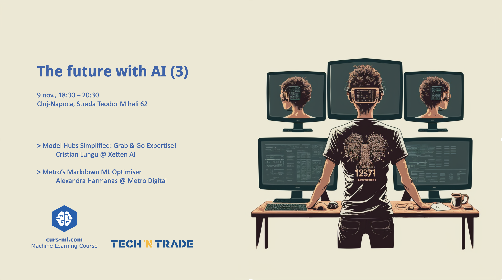

# [Agenda](agenda.pdf)

* Introductions
* AI news
* Announcements

# [Model Hubs Simplified: Grab & Go Expertise!]()
Dive into the world of AI with ease! This talk, unveils the treasure trove of pre-trained models at your fingertips. Discover how PyTorch Hub, Hugging Face, TensorFlow Hub and more can supercharge your projects, reducing the time from idea to implementation. Whether you're a beginner or a seasoned pro, you'll leave with the know-how to harness cutting-edge AI with a simple import statement. Join us to transform your code with top-tier AI models – effortlessly!

# [Metro’s Markdown ML Optimiser]()
Uncover the secrets of revenue growth with "Metro’s Markdown ML Optimiser." Learn how Metro Digital applies advanced machine learning to master the art of price discounting, crafting strategies that not only attract customers but also maximize profits. Join us for insights into AI-driven revenue enhancement!

# Photos gallery

