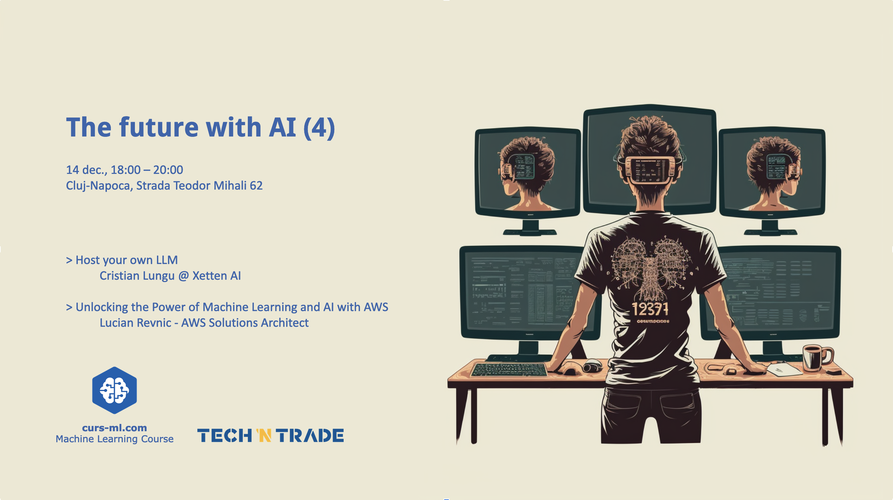

# [Agenda](Agenda.pdf)

* Introductions
* AI news
* Announcements

# [Host your own LLM](...)
by Cristian Lungu

The session starts by demystifying the complex architecture of Large  Language Models, highlighting their unique capabilities in processing  and generating human-like text. We then transition to the practical  aspects, on the intricate process of hosting and  maintaining a local LLM. This includes a discussion about  appropriate hardware and software, ensuring data privacy, ethical  considerations, and optimizing performance for specific applications.  The talk also explores a few innovative uses of LLMs  demonstrating their transformative potential. 

# [Unlocking the Power of Machine Learning and AI with AWS]()
by Lucian Revnic

In this session will introduce existing Machine Learning and AI services from AWS, their main use cases and 
we'll go over the recent AI and ML announcements and services from AWS re:Invent 2023 such as Amazon Q. 

Whether you're a seasoned practitioner or just beginning your journey in the realm of AI, this session promises to be an engaging exploration of the forefront of technology

Lucian Revnic is a software architect, AWS instructor, and recognized AWS Community Builder in Romania, boasting nearly two decades of expertise in crafting cutting-edge enterprise products within the realm of IT Operation Management. 
As the organizer of the Transylvania Cloud Meetup group (https://www.meetup.com/TransylvaniaCloud/), Lucian is passionate about fostering local tech communities and has been delving into cloud technologies since 2015.

# Photos gallery

