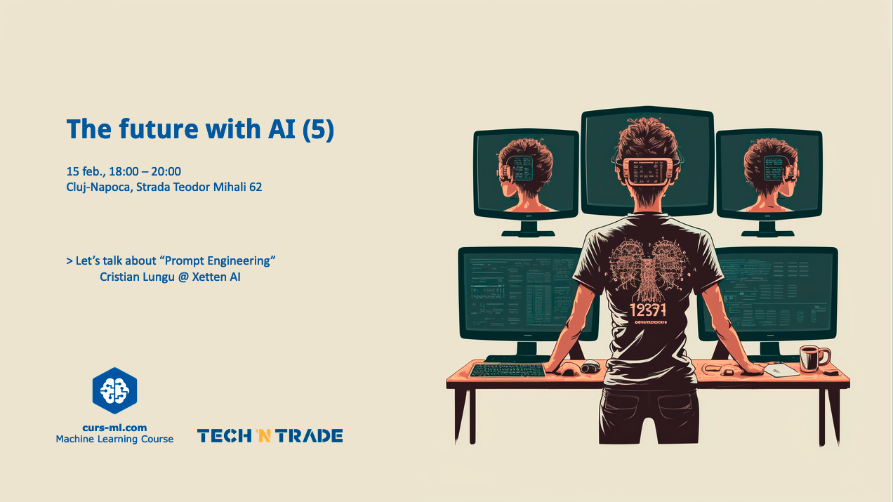

# [Agenda]("The future with AI (5).pdf")

* Introductions
* AI news
* Announcements

# [Let's talk about "Prompt Engineering"](<The future with AI (5).pdf>)
by Cristian Lungu

Prompt Engineering is key for getting good LLM output. This is true for ChatGPT any other NLP models. We'll dissect strategies of effective prompt design, emphasizing context, clarity, and user experience. The session will also explore strategies for crafting personalized, accurate prompts, integrating machine learning techniques to enhance response precision. Ethical AI frameworks and data privacy considerations in prompt creation will also be discussed, addressing the challenges and ethical dilemmas in the discipline.

This talk is aimed at developers, researchers, AI enthusiasts, and user experience designers, providing insights into the impact of prompt engineering on AI training, learning processes, and user interactions. Join us to uncover how prompt engineering is not just about queries, but about data, models and applications.

# [Event page](https://www.curs-ml.com/event-info/the-future-with-ai-5)

# Photos gallery

