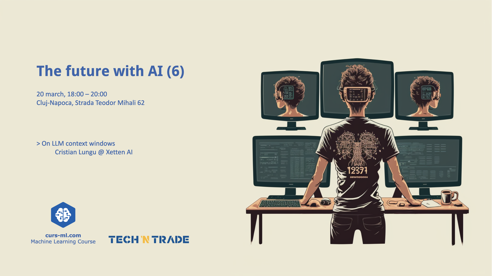

# [Event page](https://www.curs-ml.com/event-info/the-future-with-ai-6-1)

# [On LLM context windows](<The future with AI (6).pdf>)
by Cristian Lungu

This technical presentation addresses the core mechanisms and  constraints of Large Language Models (LLMs) focusing on tokenization  methods, context window sizes, and their inherent limitations. The talk emphasizes the context window's critical  function in defining the scope of text LLMs to consider, directly  affecting coherence and contextual relevance in output. We will also be discussing the apparent Moore's law on the increase of their length. Highlighting  these limitations, we will be discussing potential solutions,  offering insight into adaptive context windows and advanced  tokenization techniques to enhance LLM performance and applicability in  complex linguistic tasks.

# Photos gallery

