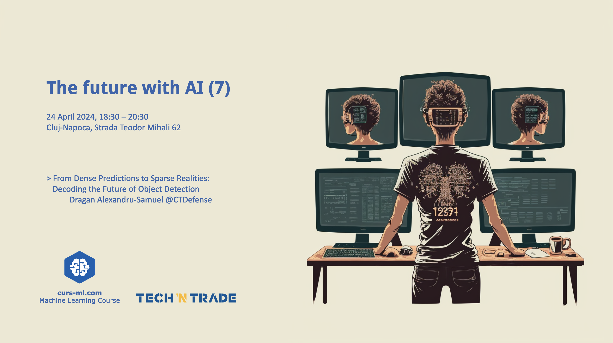

# [Event page](https://www.curs-ml.com/event-info/the-future-with-ai-7)

# [Agenda](agenda.pdf)

* Introductions
* AI news
* Announcements

# [From Dense Predictions to Sparse Realities: Decoding the Future of Object Detection](From_Dense_Predictions_to_Sparse_Realities_Decoding_the_Future_of_Object_Detection.pdf)
by Alex Dragan

Join us as we delve into the evolving landscape of object detection through an engaging exploration of three seminal papers: DETR (Detection Transformer), Sparse R-CNN, and DeFCN. This presentation aims to deliver a captivating journey from the dense layers of convolutional networks to the streamlined efficiencies of sparse predictions. We'll decode how these architectures redefine accuracy and speed in object detection, challenging traditional methods and setting the ground for new research. Whether you're a seasoned researcher or a curious novice, prepare to be intrigued by the innovative strategies that are setting new benchmarks in the field or object detection.

# Photos gallery

